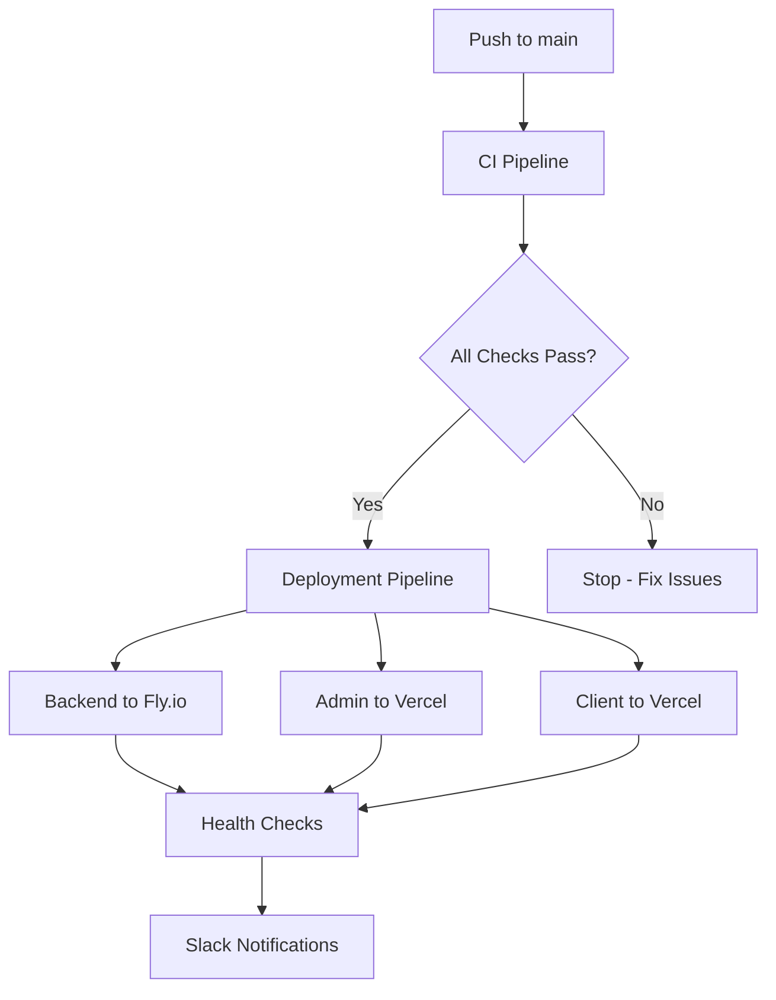

# 🚀 CI/CD Pipeline Documentation

This document outlines the complete Continuous Integration and Continuous Deployment (CI/CD) pipeline for the Blunari SAAS monorepo.

## 📋 Overview

The CI/CD pipeline consists of two main workflows:

1. **Continuous Integration** (`ci.yml`) - Quality checks, testing, and build verification
2. **Continuous Deployment** (`deploy.yml`) - Automated deployment to production environments

## 🔧 Pipeline Architecture



## 🛠️ Required Secrets

You need to configure the following secrets in your GitHub repository settings:

### Fly.io Secrets

- `FLY_API_TOKEN` - Your Fly.io API token for backend deployment

### Vercel Secrets

- `VERCEL_TOKEN` - Your Vercel API token
- `VERCEL_ORG_ID` - Your Vercel organization ID
- `VERCEL_ADMIN_PROJECT_ID` - Project ID for admin dashboard
- `VERCEL_CLIENT_PROJECT_ID` - Project ID for client dashboard

### Environment Variables

- `VITE_BACKGROUND_OPS_URL` - Production API URL
- `VITE_BACKGROUND_OPS_API_KEY` - API key for background operations
- `VITE_SUPABASE_URL` - Your Supabase project URL
- `VITE_SUPABASE_ANON_KEY` - Your Supabase anonymous key

### Notifications (Optional)

- `SLACK_WEBHOOK` - Slack webhook URL for deployment notifications

## 🚀 Setup Instructions

### 1. Configure GitHub Secrets

Navigate to your repository settings and add the secrets listed above:

```
Repository → Settings → Secrets and variables → Actions → New repository secret
```

### 2. Get Fly.io API Token

```bash
flyctl auth token
```

### 3. Get Vercel Tokens and IDs

```bash
# Install Vercel CLI
npm i -g vercel

# Login and get org ID
vercel login
vercel teams list

# Link projects and get project IDs
cd apps/admin-dashboard
vercel link
vercel project list

cd ../client-dashboard
vercel link
vercel project list
```

### 4. Configure Supabase Variables

Get these from your Supabase project dashboard:

- Project URL: `https://your-project.supabase.co`
- Anonymous Key: From Settings → API

## 🔄 Pipeline Triggers

### CI Pipeline Triggers:

- Push to `main` or `master` branch
- Pull requests to `main` or `master` branch
- Manual dispatch via GitHub Actions UI

### Deployment Pipeline Triggers:

- Push to `main` or `master` branch (after CI passes)
- Manual dispatch for emergency deployments

## 📊 Pipeline Stages

### CI Pipeline (ci.yml)

1. **Code Quality** (5 min timeout)
   - ESLint checks with error reporting
   - Prettier formatting validation
   - TypeScript compilation

2. **Security Scan** (10 min timeout)
   - Dependency vulnerability scanning
   - Secret detection
   - License compliance

3. **Testing** (15 min timeout)
   - Unit tests for all packages
   - Integration tests
   - E2E tests with Playwright

4. **Build Verification** (10 min timeout)
   - Build all apps and packages
   - Verify build artifacts
   - Check bundle sizes

### Deployment Pipeline (deploy.yml)

1. **Preparation** (5 min timeout)
   - Detect changed components
   - Generate deployment version
   - Set deployment flags

2. **Backend Deployment** (10 min timeout)
   - Build production backend
   - Deploy to Fly.io
   - Health check verification

3. **Frontend Deployments** (10 min timeout each)
   - Build admin and client dashboards
   - Deploy to Vercel
   - Verify deployments

4. **Post-Deployment** (5 min timeout)
   - Comprehensive health checks
   - Slack notifications
   - Rollback on failure

## 🔍 Monitoring & Notifications

### Slack Integration

Configure Slack webhook to receive:

- Deployment status updates
- Build failure notifications
- Health check results
- Rollback notifications

### Health Checks

Automated checks verify:

- Backend API endpoints
- Database connectivity
- Frontend application loading
- Critical user flows

## 🛡️ Security Features

- **Secret Management**: All sensitive data stored in GitHub Secrets
- **Environment Isolation**: Separate production environment
- **Access Controls**: Limited deployment permissions
- **Vulnerability Scanning**: Automated security checks
- **Rollback Capability**: Quick rollback on failure

## 📈 Performance Optimizations

- **Parallel Execution**: Multiple jobs run simultaneously
- **Smart Caching**: Node modules and build artifacts cached
- **Incremental Deployments**: Only deploy changed components
- **Build Optimization**: Production-optimized builds

## 🔧 Troubleshooting

### Common Issues

1. **Build Failures**

   ```bash
   # Check local build
   npm run build --workspaces

   # Fix lint issues
   npm run lint:fix --workspaces
   ```

2. **Deployment Failures**

   ```bash
   # Check Fly.io status
   flyctl status --app background-ops

   # Check Vercel deployments
   vercel ls
   ```

3. **Secret Issues**
   - Verify all required secrets are set
   - Check secret names match exactly
   - Ensure tokens have proper permissions

### Manual Rollback

If automated rollback fails:

```bash
# Rollback backend
flyctl releases rollback --app background-ops

# Rollback frontend
vercel rollback --token=your-token
```

## 📝 Maintenance

### Regular Tasks

- Monitor build times and optimize if needed
- Update dependencies monthly
- Review and rotate API tokens quarterly
- Check Slack notification channel

### Pipeline Updates

- Test changes on feature branches first
- Update timeout values based on performance
- Add new quality checks as needed
- Monitor resource usage and adjust

## 🎯 Success Metrics

Track these metrics to ensure pipeline health:

- **Build Success Rate**: >95% target
- **Deployment Time**: <10 minutes total
- **Time to Recovery**: <5 minutes
- **Test Coverage**: >80% minimum

## 🤝 Contributing

When contributing to the CI/CD pipeline:

1. Test changes in fork first
2. Update documentation
3. Add appropriate timeout values
4. Include proper error handling
5. Update this README if needed

---

For questions or issues, contact the DevOps team or create an issue in the repository.
