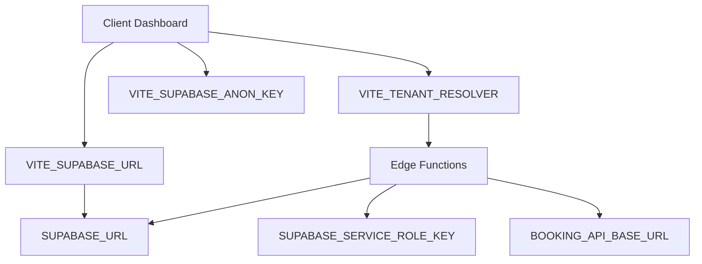

# Environment Variables Documentation

This document maps all environment variables to their owners and purpose for the Blunari SAAS Command Center implementation.

## Client Dashboard Environment Variables

### Database & Authentication
| Variable | Owner | Purpose | Required | Example |
|----------|-------|---------|----------|---------|
| `VITE_SUPABASE_URL` | Frontend | Supabase project URL | Yes | `https://your-project.supabase.co` |
| `VITE_SUPABASE_ANON_KEY` | Frontend | Supabase anonymous key | Yes | `eyJhbGciOiJIUzI1NiIsInR5cCI6...` |

### API Configuration
| Variable | Owner | Purpose | Required | Example |
|----------|-------|---------|----------|---------|
| `VITE_CLIENT_API_BASE_URL` | Frontend | Booking API base URL | Optional | `https://api.example.com` |
| `VITE_TENANT_RESOLVER` | Frontend | Tenant resolution endpoint | Yes | `/functions/tenant` |

### Feature Flags
| Variable | Owner | Purpose | Required | Example |
|----------|-------|---------|----------|---------|
| `VITE_APP_ENV` | Frontend | Environment identifier | Yes | `development` / `production` |
| `VITE_ENABLE_MOCK_DATA` | Frontend | Enable mock data in dev | No | `true` / `false` |

## Supabase Edge Functions Environment Variables

### Database Access
| Variable | Owner | Purpose | Required | Example |
|----------|-------|---------|----------|---------|
| `SUPABASE_URL` | Edge Functions | Supabase URL (auto-injected) | Yes | `https://your-project.supabase.co` |
| `SUPABASE_SERVICE_ROLE_KEY` | Edge Functions | Service role key (auto-injected) | Yes | `eyJhbGciOiJIUzI1NiIsInR5cCI6...` |

### External API Integration
| Variable | Owner | Purpose | Required | Example |
|----------|-------|---------|----------|---------|
| `BOOKING_API_BASE_URL` | Edge Functions | External booking API URL | Optional | `https://booking-api.example.com` |
| `BOOKING_API_KEY` | Edge Functions | External API authentication | Optional | `pk_live_123...` |
| `SIGNING_SECRET` | Edge Functions | HMAC signing secret | Optional | `whsec_123...` |

## Setup Instructions

### 1. Client Dashboard (.env)
```bash
# Copy .env.example to .env
cp .env.example .env

# Update with your values:
VITE_SUPABASE_URL=https://your-project.supabase.co
VITE_SUPABASE_ANON_KEY=your-anon-key
VITE_CLIENT_API_BASE_URL=https://your-booking-api.com
VITE_TENANT_RESOLVER=/functions/tenant
VITE_APP_ENV=development
VITE_ENABLE_MOCK_DATA=false
```

### 2. Supabase Project Settings
Navigate to your Supabase project > Settings > Environment Variables and add:

```bash
BOOKING_API_BASE_URL=https://your-booking-api.com
BOOKING_API_KEY=your-api-key
SIGNING_SECRET=your-hmac-secret
```

### 3. Deployment Considerations

#### Development
- Set `VITE_ENABLE_MOCK_DATA=true` to use mock data
- Use `VITE_APP_ENV=development` for development features

#### Production
- **NEVER** set `VITE_ENABLE_MOCK_DATA=true` in production
- Use `VITE_APP_ENV=production`
- Ensure all API keys are properly secured
- Use HTTPS for all external API URLs

### 4. Security Best Practices

1. **Never commit secrets**: All sensitive values should be in environment variables
2. **Use different keys per environment**: Development and production should have separate credentials
3. **Rotate keys regularly**: API keys should be rotated periodically
4. **Restrict API access**: Use IP restrictions where possible
5. **Monitor usage**: Set up alerts for unusual API usage patterns

### 5. Troubleshooting

#### Mock Data Issues
- If you see "🟡 Using mock data" warnings in production, check `VITE_ENABLE_MOCK_DATA`
- Mock data should only appear when `VITE_APP_ENV=development` AND `VITE_ENABLE_MOCK_DATA=true`

#### Authentication Errors
- Verify `VITE_SUPABASE_URL` and `VITE_SUPABASE_ANON_KEY` are correct
- Check that RLS policies are properly configured in Supabase

#### Function Invocation Errors
- Ensure Edge Functions are deployed: `supabase functions deploy --project-ref your-ref`
- Verify `VITE_TENANT_RESOLVER` matches your function name
- Check function logs in Supabase dashboard

#### API Integration Issues
- Verify `BOOKING_API_BASE_URL` is reachable from Edge Functions
- Test API authentication with curl before deployment
- Check that `SIGNING_SECRET` matches on both ends if using HMAC

## Variable Dependencies



This configuration enables:
- ✅ Zero mock data in production
- ✅ Secure tenant resolution
- ✅ Idempotent API operations
- ✅ Real-time updates via Supabase
- ✅ Error tracking with request IDs
- ✅ Proper authentication flow
